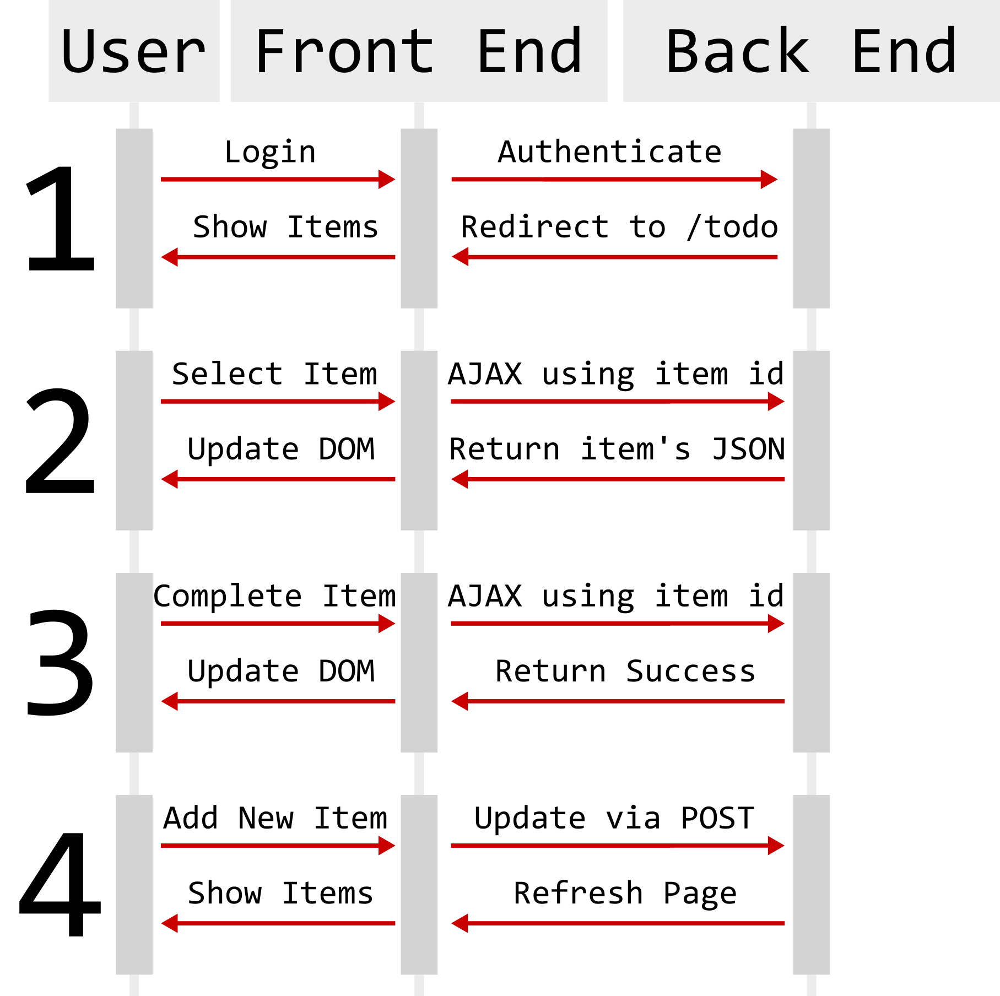

# todo_django - WIP README - NOW LIVE!: http://todo-dj.herokuapp.com/todo/ 

# Intro:
My name is Noah - I'm an aspiring developer and this is one of my side projects. This readme document will cover the why, how, and the what. **Why I built this, How I built this, and What I accomplished.**

# Why build a TODO app?
Although the business logic is pretty straight forward, I saw it as a great opportunity to learn front-end skills. This includes:
* Building a responsive(-ish) site using Bootstrap.
* Designing clean, stylish designs using CSS & Bootstrap
* Using AJAX requests to update content on the page
* Adding animations via CSS Transitions & jQuery code

Although at the outset I didn't know much of the above, I did know there were a ton of resources to help me in implementing the features & feel I wanted. Django, HTML/CSS/JS & jQuery all have big communities, enabling me to learn and build quicker. 

# How does it work?
**UML Diagram**
In broad strokes, the three most key players are the user (the person), the front end (html/css/js) and the back end (django).

As shown in the diagram, there are four ways a user can interact with the app. I will breifly cover how this looks; if you are interested in more granualarity, check the appendix. 

# What did I accomplish & learn?

# Resources & References
**Other people's code**
* Date picker: https://github.com/dbushell/Pikaday
**Tutorials which cover the basics of setting up Django**
* Offical docs: https://docs.djangoproject.com/en/1.11/intro/tutorial01/
* Excellent tutorial: https://tutorial.djangogirls.org/en/
**Youtube tutorials**
* User login/authentication: https://www.youtube.com/watch?v=BIgVhBBm6zI
**Official Documentation**
* Django: https://docs.djangoproject.com/en/1.11/
* jQuery: https://api.jquery.com/
* Bootstrap: https://v4-alpha.getbootstrap.com/getting-started/introduction/
**Unofficial Documentation**
* All around resource: https://www.w3schools.com/
**Blogs, Stackoverflow, and other misc sites for specific issues**

# Appendix
