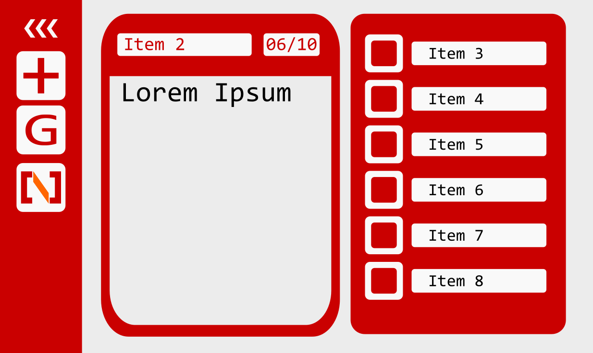

# todo_django - http://todo-dj.herokuapp.com/
**Instructions:** https://github.com/noah-dev/todo_django/blob/master/instructions.png

# Intro:
My name is Noah - I'm an aspiring developer, and this is one of my side projects. This readme document will cover the why, how, and the what. **Why I built this, How I built this, and What I accomplished.**

# Why build a TODO app?
Although the concept is pretty straightforward, I saw it as an opportunity to challenge myself to learn new tools and find achievement. My focus was on front-end work, such as great design and great user interface. This includes:

* Building a responsive(-ish) site using Bootstrap.
* Designing clean, stylish designs using CSS & Bootstrap
* Creating a user interface that enables users to select and display an item
* Adding animations via CSS Transitions & jQuery code

Initially, back-end work was on the back-burner, but later I chose to implement accounts and login. (see "[What did I accomplish & learn?](https://github.com/noah-dev/todo_django/blob/master/README.md#what-did-i-accomplish--learn)")

Although at the outset I didn't know much of the above, I did know there were a ton of resources to help me in implementing the features & feel I wanted. Django, HTML/CSS/JS & jQuery all have big communities, enabling me to learn and build quicker. 

# How does it work?
In broad strokes, the three key players are the user (the person), the front end (HTML,CSS,JS) and the back end (Django/Postgres).

As shown in the diagram, there are four ways a user can interact with the app. I will briefly cover how this looks; if you are interested in more granularity, check the appendix. 

**1: Login** 

Each user has their own list of items. In order to access the list, the user must first login. This is accomplished by using Django's built-in user authentication system. After typing in and submitting the login form, Django will authenticate the credentials against a table in Postgres. If successful, Django will log the user in and redirect to the todo page, which shows the list of items. 

**2: Select An Item From The Right**

As seen in the demo, the todo page is split into two main sections (excluding the navbar). Let's call them left-side and right-side. The left-side shows one item in detail while the right-side shows all items with fewer details. To change which item the left-side shows, the user clicks on an item from the right-side. An item will go pale upon hover over, and once clicked an AJAX request will fetch that item's details from Postgres. Once retrieved from Postgres, the front end will update the DOM elements of the left-side to show the selected item's details.

**3: Toggle completion status of Item**

On the left-side, the item's details are shown. At the bottom is a checkbox to indicate whether or not the item is complete. If the item is complete, the checkbox will already be checked. If the user clicks on the checkbox and toggles the state, an AJAX request is sent to Django. Django will update the appropriate record in Postgres and return. From there, the front end will update the DOM elements of both the left-side (for the checkbox) and the right-side (for the completion status)

**4: Add New Item**

By clicking on the plus sign, the user may add a new item. Once complete and submitted, Django will receive the POST request and add a new record to Postgres. Django will then provide a new HTML page to the front end. This new HTML page will contain the newly added item and will be visible to the user. 

# What did I accomplish & learn?

**1: I Met My Goals (And Then Some)**

I knew I wanted to build a TODO app with great design. I used Inkscape to create a mock-up to establish not only the look and feel, but also imagine how the user might interact. The color palette, three column design (navbar, left-side & right-side) were established. I imagined the entire list of items shown on the right-side, with the user selecting an item to be displayed in detail on the left-side. The navbar on the left would be able to collapse/expand and would show links to add new items or go to the repo. The Inkscape mock-up is shown below. 

The result looks a bit different, but in the spirit it accomplishes everything the mock-up envisioned. And then some. I did not intend to build a Login feature; but as I thought about user experience, having the ability to login would make the app much better. If I shared the app with multiple people, the list could become unruly and confusing. 

Though it would increase the scope of the project, I did some research to estimate the cost. I found a series of step-by-step Youtube videos that covered the feature, showing how to use Django's built-in user authentication module. Instead of spending weeks working through official docs and trial and error, with these videos, I realized I could implement this quickly at minimal time cost. After 2 days, the feature was implemented and deployed.

I am very satisfied with the end result. It takes a simple concept, and expands on it by adding slick design, nice user interface, and a login page. I learned new tools, became proficient with them, and executed to create something I am proud of.

**2: jQuery, AJAX & Login**

At first, I didn't know jQuery. I had only used it for Bootstrap. A key part of my user interface was selecting items from the right-side and having it show on the left-side. To that end, I learned jQuery to execute code upon clicking certain elements. 

To show the selected item on the left-side, I planned on Django serving new HTML files. That would require a page refresh, and wondered if there was a better way. Google searching led me to AJAX requests. After some learning, trying and failing, I implemented a basic AJAX request to retrieve the appropriate record from Postgres. I then learned to use jQuery to populate the text of DOM elements. AJAX requests are also used in updating the completion status of an item. 

As previously mentioned, having a login feature would improve the user experience. This was the first time I ever implemented such a feature, and I was grateful for the great Django community. The series of Youtube videos were super helpful; it taught me enough to implement a login page. From there I added a new field to the database for username, so that the right items could be shown to the right users. The code was updated to account for the username field and now require user login. Once complete, the end result worked as I had hoped. 

**3: I'm A Better Web Dev**

Tying into the previous three, accomplishing a project like this has shown me a lot of new ways to solve challenges. Having gone through managing a database, UI design, login authentication and deployment for this small project gives me new appreciation for the many web applications that I rely on. The fact that I accomplished this feels me with the spirit to learn new things and move on to tackle new, bigger, better projects.

# Resources & References
**Other people's code**
* Date picker: https://github.com/dbushell/Pikaday

**Tutorials which cover the basics of setting up Django**
* Offical tutorial: https://docs.djangoproject.com/en/1.11/intro/tutorial01/
* Excellent tutorial: https://tutorial.djangogirls.org/en/

**Youtube tutorials**
* User login/authentication: https://www.youtube.com/watch?v=BIgVhBBm6zI

**Official Documentation**
* Django: https://docs.djangoproject.com/en/1.11/
* jQuery: https://api.jquery.com/
* Bootstrap: https://v4-alpha.getbootstrap.com/getting-started/introduction/

**Unofficial Documentation**
* All around resource: https://www.w3schools.com/

**Blogs, Stackoverflow, and other misc sites for specific issues**

# Appendix

**Note:** In Django, routing is handled by the urls.py files. This appendix shall exclude those files, but they are responsible for matching up a url with the appropriate function in the appropriate views.py file. There are three urls.py files, located within /todo_dj, /login, and /todo

There is a function within views.py called login_view. That views.py sits within the login folder, and the login folder sits in the root. This will be equivalent to login.views.login_view. Static files (such as CSS/JS) are collected into a single folder during deployment; but during development, the static files sit in their appropriate folders. 

**1: Login**
* User Submits Credentials 
* Route to login.views.login_view
* Using Django functions, clean and validate the data. If valid, redirect to todo page
* Routes to todo.views.index
* Retrive the appropriate records from Postgres and render HTML template todo.templates.todo.index.html
* There are additional cases if the user is already logged in, credentials are invalid or if credentials not yet submitted.
* If user is already logged in, redirect to todo page. If credentials are invalid raise an error. If credentials not yet submitted, render HTML template login.templates.login.login.html

**2: Select An Item From The Right**
* User hovers over an item - CSS will set opacity to 50%. (Style file at todo.static.todo.style.css)
* User clicks on item 
* Triggers jQuery function at todo.static.todo.main.$(".item").click
* When the todo page is served by Django, each item's DOM id is equal to the primary key in Postgres. Using this id, create an AJAX request to retrieve the record from Postgres
* Route to todo.views.show_item
* Retrieve the id from the AJAX request and find the record in Postgres.
* Convert the dates to Central Timezone, convert to JSON and return as a JsonResponse
* Back in todo.static.todo.main.$(".item").click, parse the returned Json and fill out the DOM elements in the left-side. 

**3: Toggle completion status of Item**
* User clicks on the checkbox for the item in the left-side.
* Triggers jQuery function at $('input[name="item_complete"]').on
* Retrieve the checkbox's id and its status (checked or unchecked). The checkbox's id is the item's primary key in Postgres. 
* Send an AJAX request with the item's id (primary key) and if its completion is True/False.
* Route to todo.views.complete_item
* Retrieve the item from Postgres and set the complete field to the appropriate value. 
* Return an response (no useful data)
* Back in $('input[name="item_complete"]').on, update the DOM elements in the left-side and right-side to indicate the database has been updated. 

**4: Add New Item**
* User clicks on the plus icon, fills out the form and submits.
* Routes to todo.views.add_item
* Retrieve the info from the POST form, including the item's title, desc, due date and other fields. 
* Start date and Due date are set to end of day. (From 8/1/2017 to 8/1/2017, 23:59:59:999999)
* The record is saved and reverse redirect to todo page.
* Routes to todo.views.index
* Retrive the appropriate records from Postgres and render HTML template todo.templates.todo.index.html
